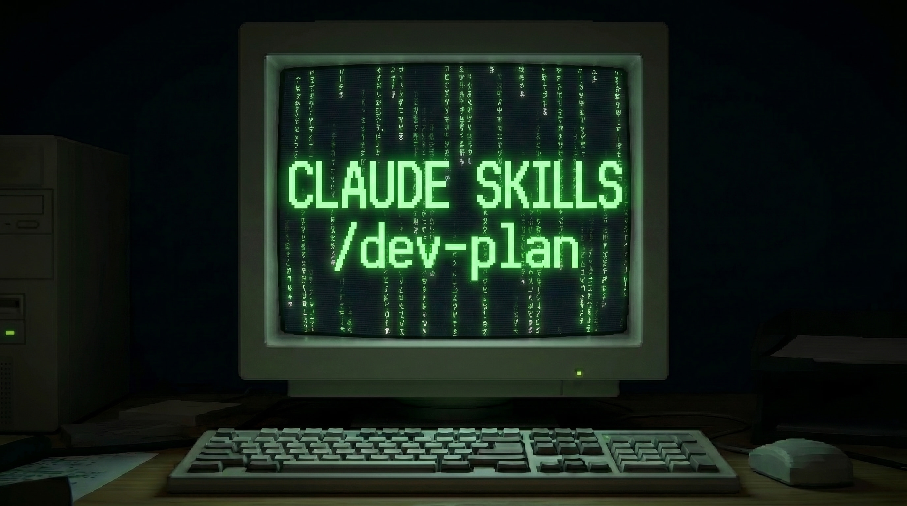

# dev-plan-skill

*A Claude Code skill for structured, scored, terminal-readable development plans — the same format every session.*



`/dev-plan` turns a complex coding request into a structured development plan that survives across sessions: classified tracks, priority ranking, dependencies drawn, status tracked with glyphs. The skill holds the scaffold, provides a structured progress reference, and is ideal with human-in-the-loop oversight.

## Read about the skill

The story, the design decisions, and the head-to-head test against Claude Code's Plan Mode are in the [Medium article](https://medium.com/@erikntaylor/making-better-development-plans-into-a-skill-for-claude-code-093db647b404). The two plans in `examples/` are the real outputs from that test.


## Install

Clone the repository to get started:
```bash
git clone https://github.com/eriktaylor/dev-plan-skill.git
```

For a global install, available in every project:
```bash
mkdir -p ~/.claude/skills
cp -r ~/dev-plan-skill/dev-plan ~/.claude/skills/dev-plan
```

Or scope it to a specific project directory:
```bash
mkdir -p .claude/skills
cp -r ~/dev-plan-skill/dev-plan .claude/skills/dev-plan
```

The resulting folder layout will look like this:
```text
.claude/
└── skills/
    └── dev-plan/
        ├── SKILL.md                  # Router + simple-plan format
        └── references/
            └── complex-plan.md       # Full complex format
```

Now the skill is installed and ready to use. To run it in the CLI:
```bash
claude
# Inside the session, type: /dev-plan
```

## Simple or complex

The skill routes on one decision. A **simple** plan is a short, sequential change — goal, steps, done-when. A **complex** plan — interdependent tracks, anything that touches production — gets the full format above, loaded from `references/complex-plan.md` only when it's needed.

Both plans track status via glyph vocabulary per item, flipped in place:

```
✅  complete
🔄  in-progress
💡  proposed (recommended next)
⏸️  deferred (with re-open trigger)
·   not started
```

A simple plan is ordered by priority:

```
Priority = Impact ÷ Difficulty        (qualitative)
```

## What a complex plan looks like

A complex plan uses linear weighting system to score and rank plan items, decided at the outset:

```
**The score.** Rate each item 0–3 on four dimensions, then combine:

    Score = w_U·U + w_C·C + w_E·E − w_R·R

- **U — user impact** — value visible to the user (features, UX, visualization).
- **C — core impact** — value to the codebase/infra (tooling, simplification,
  de-risking, evaluation).
- **E — ease** — inverse effort (3 = trivial, 0 = a slog).
- **R — risk** — blast radius if it goes wrong; the only term that subtracts.
```

Dependencies are written in plain text, grouped into waves, with the critical path called out:

```
Wave 1 — installable local skeleton (MVP):
  T-1 ──→ F-2 ──→ F-3                  (critical path)
  T-1 ──→ F-1
          S-1                          (rules-only, parallel)

Wave 2 — usable LOCAL MVP (no Claude required):
  F-3 ──→ V-1 (dropdown)
  S-1 ──→ V-4 (confirm-before-run) ──→ F-1
```

A complex plan is further structured via:
- Classification - tracks are classified
- Phase diagram - grouped waves (shown above)
- Implementation order - scored and ranked by score
- Production safety - always consider what touches the main path

## Repo layout

```text
dev-plan-skill/
├─ README.md
├─ dev-plan/                          # the skill — copy into ~/.claude/skills/
│  ├─ SKILL.md                        # router + simple-plan format (always loaded)
│  └─ references/complex-plan.md      # full complex format (loaded on demand)
├─ method/dev-plan-testing-methods.md # reproduce the Plan Mode vs skill test
└─ examples/
   ├─ default_plan.md                 # Arm A — Claude /plan mode
   └─ dev-plan_terminal_agent.md      # Arm B — /dev-plan skill
```

